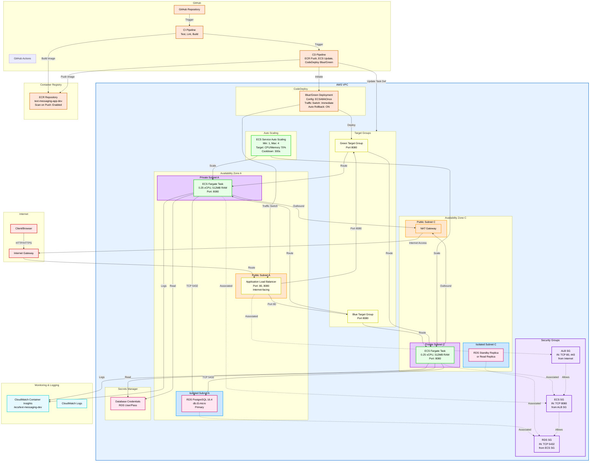

# Text Messaging App - AWS Infrastructure Architecture

This diagram illustrates the complete AWS infrastructure for the Text Messaging App, including network topology, compute resources, database, container registry, CI/CD pipeline, and monitoring.

## Architecture Components

### Network Layer
- **VPC**: Spans 2 Availability Zones for high availability
- **Public Subnets**: Host ALB and NAT Gateway for external traffic routing
- **Private Subnets**: Host ECS Fargate tasks with outbound NAT access
- **Isolated Subnets**: Host RDS PostgreSQL with no internet access
- **Internet Gateway**: Routes inbound traffic from clients
- **NAT Gateway**: Provides outbound internet access for ECS tasks

### Security Layer
- **ALB Security Group**: Accepts HTTP/HTTPS from internet
- **ECS Security Group**: Accepts port 8080 only from ALB
- **RDS Security Group**: Accepts port 5432 only from ECS tasks
- **Secrets Manager**: Manages RDS database credentials securely

### Compute Layer
- **ECS Fargate**: Serverless container execution (0.25 vCPU, 512MB RAM)
- **Auto Scaling**: Scales between 1-4 tasks based on CPU/Memory (target 70%)
- **Task Distribution**: Distributed across 2 AZs for fault tolerance

### Load Balancing
- **ALB**: Internet-facing with dual listeners
- **Blue Target Group**: Production traffic on port 80
- **Green Target Group**: Staging/test traffic on port 8080
- **Blue/Green Deployment**: Enables safe, zero-downtime deployments

### Database Layer
- **RDS PostgreSQL 16.4**: db.t3.micro instance
- **Multi-AZ**: Configured for production reliability
- **Isolated Subnets**: No direct internet access
- **Credentials**: Managed by AWS Secrets Manager

### Container Registry
- **ECR Repository**: Stores Docker images for the application
- **Scan on Push**: Automatically scans images for vulnerabilities
- **ImagePullCredentials**: Used by ECS tasks to pull container images

### CI/CD Pipeline
- **GitHub Actions CI**: Runs tests, linting, and builds Docker images
- **GitHub Actions CD**: Uses OIDC for secure AWS authentication
- **ECR Push**: Publishes built images to container registry
- **ECS Task Definition**: Updated with new image reference
- **CodeDeploy Blue/Green**: Orchestrates safe deployment with traffic switching
- **Auto Rollback**: Reverts to Blue environment if deployment fails

### Monitoring & Logging
- **CloudWatch Container Insights**: Monitors ECS cluster performance
- **CloudWatch Logs**: Centralized logging for all ECS tasks
- **Log Group**: `/ecs/text-messaging-dev` aggregates all application logs

## Traffic Flow

1. **Inbound**: Client → Internet Gateway → ALB (Port 80/8080)
2. **Routing**: ALB → Blue/Green Target Groups → ECS Tasks
3. **Database**: ECS Tasks → RDS PostgreSQL (Port 5432)
4. **Outbound**: ECS Tasks → NAT Gateway → Internet Gateway
5. **Deployment**: GitHub Actions → ECR → ECS Task Definition → CodeDeploy → ALB Traffic Switch

## Key Features

- **High Availability**: Multi-AZ deployment with auto-scaling
- **Zero-Downtime Deployments**: Blue/Green strategy via CodeDeploy
- **Security**: Network segmentation with security groups and isolated database subnet
- **Cost Optimization**: Single NAT Gateway, Fargate spot instances, minimal task sizing
- **Observability**: Comprehensive logging and monitoring via CloudWatch
- **Automation**: CI/CD pipeline fully automated with GitHub Actions
